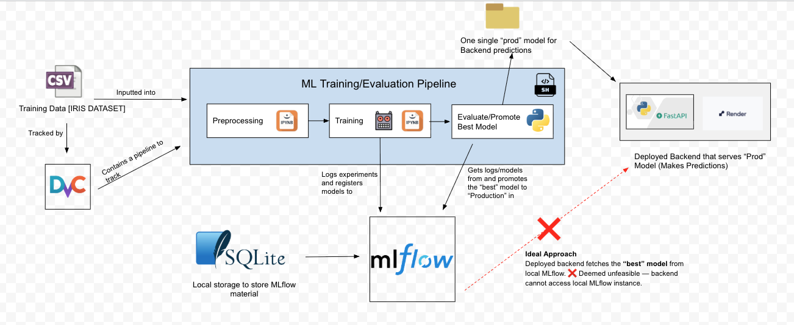
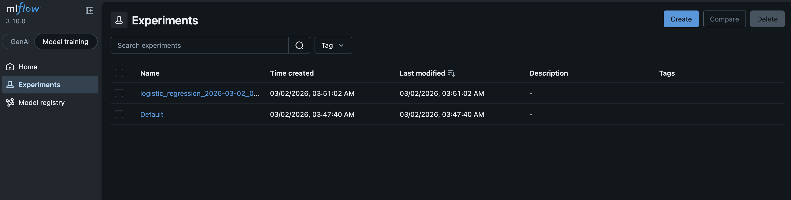
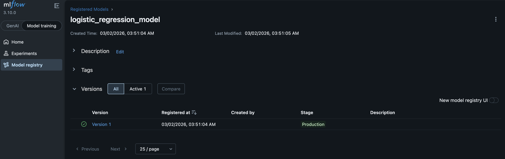

# End-to-End MLOps Pipeline for Iris Classification

This project outlines a complete end-to-end MLOps pipeline for classifying the classic Iris dataset. It covers the full machine learning lifecycle—from data preprocessing and model training to data & model versioning, tracking, promotion, and deployment—using modern MLOps tools and best practices.

## Key Terms

- **Best Model:**  
  The model with the highest validation accuracy during training and evaluation.

- **Model Promotion:**  
  If a newly trained model outperforms the current **Production** model in MLflow, it is **promoted** to take its place. This ensures that the deployment always serves the most accurate model.

## System Architecture



## Key Features

- **Data Preprocessing & Model Training**  
  Cleaned, scaled, and trained multiple logistic regression models on the Iris dataset.

- **DVC (Data Version Control)**  
  Manages dataset and model versioning, ensuring reproducibility across experiments.

- **MLflow Integration**  
  Tracks experiments, metrics, and model versions; automatically promotes the “best” model.

- **Model Serving with FastAPI**  
  Exposes the best model as a REST API for real-time predictions.

- **Deployment on Render**  
  Production-ready deployment accessible via a public endpoint.

- **CI/CD Automation with GitHub Actions**  
  Automatically tests, builds, and deploys the FastAPI backend on each push.

## Quickstart

### General Set-up

1. Clone this project.

2. Create a Python environment and install dependencies:

```bash
python3 -m venv .venv
source .venv/bin/activate
pip install -r requirements.txt
```

### Run MLOps Pipeline

1. Ensure your Python environment is activated.

2. In another terminal, run:

```bash
source .venv/bin/activate
mlflow server --backend-store-uri sqlite:///mlflow.db
```
In this step, open `http://127.0.0.1:5000` in your browser to view the MLflow UI.




3. In the original terminal, run:

```bash
bash run_mlops_pipeline.sh
```

### Run Model Serving Backend

1. Run the app to start up the server:

```bash
fastapi dev app/main.py
```
You can access the server at `http://127.0.0.1:8000`.

2. Example Requests:

Health Endpoint (`/health`):

```bash
curl -X GET http://127.0.0.1:8000/health
```

```JSON
# Example Response
{"status":"ok","model_loaded":true}
```

Predict Endpoint (`/predict`):

```bash
curl -X POST http://127.0.0.1:8000/predict \
-H "Content-Type: application/json" \
-d '{
  "sepal_length": 5.1,
  "sepal_width": 3.5,
  "petal_length": 1.4,
  "petal_width": 0.2
}'
```

```JSON
# Example Response
{"prediction":[0]}
```

## Deployed Endpoints

The backend is deployed [here](https://mlops-iris-pipeline.onrender.com). You can use the exact same examples as above, but replace `http://127.0.0.1:8000` with `https://mlops-iris-pipeline.onrender.com`.


## Testing

Run the test suite with `pytest`:

```bash
pytest -q
```

## Tradeoffs/Decisions

### 1. Using MLflow locally
We opted to run MLflow locally, which made it easy to log, track, and promote models during development.  
**Tradeoff:** The deployed FastAPI backend cannot automatically load the “best” model from MLflow, limiting seamless integration in production.

### 2. Storing the raw Iris dataset locally
Keeping the raw Iris dataset on the local filesystem simplified preprocessing and experimentation.  
**Tradeoff:** We did not leverage DVC for remote storage, which could have improved reproducibility and collaboration. We also had trouble with `dvc repro` as we needed git to track the raw csv file.

## Acknowledgements

We got the dataset from [the UCI Machine Learning Repository – Iris Dataset](https://archive.ics.uci.edu/dataset/53/iris).

## License

This project is provided as an example; add a license file if you
intend to distribute it.